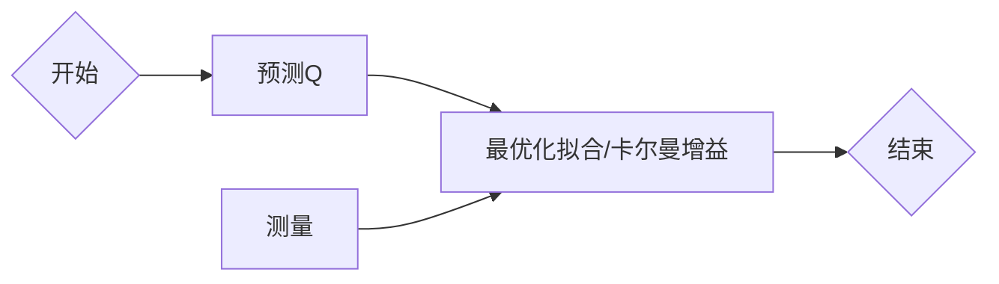

<h1 style="text-align: center;">卡尔曼滤波</h1>

卡尔曼是一种递归、考虑噪声后的最优估计的、状态观测器。

卡尔曼滤波可以去除噪声，通过动态融合预测和测量的信息，实现对系统真实状态的估计。

应用范围：信号处理、导航与定位（如GPS轨迹优化）、机器人控制、传感器数据融合等。

基本工作原理：

1. 用之前数据预测下个数据（基于系统模型的预测）
2. 比对测量值和预测值（计算两者的偏差）
3. 根据比对结果，按比例综合预测值和测量值，得出结果（通过动态权重调整，权衡预测与测量的可信度）

<h2 style = "text-align: center">前置知识</h2>

---

### 状态、状态转移方程

**状态**，系统某时刻属性。如运动小车的状态，可以是位移、速度、加速度、牵引力等。这些变量综合一起，就是状态，一般表示为向量,记为 ${\mathbf{x}}$。

**状态转移方程**，是状态从上一刻到下一刻的关系，体现为函数。转移体现在用上个状态，得出下个状态。如 ${x = x_0 + vt}$ 就是一种简单的状态转移方程。状态转移方程常用矩阵和向量表示，简化计算，标准形式为 ${ {x}_k = {F} {x}_{k-1} + {G} {u}_{k-1} }$，其中 ${\mathbf{F}_k }$是状态转移矩阵,${ \mathbf{B}_k }$是控制输入矩阵，${ \mathbf{u}_k }$是控制输入（如小车的牵引力）。

### 估计

测量某个值时，总会有噪声，可能来自环境中不可预测的随机干扰，也可能来自我们没有考虑到的变量。

我们想知道某个量的真实值，让噪声的影响最小。这个过程就是估计。

估计的本质是**最优化问题**。

### 协方差

协方差，衡量两个变量**线性关系**的强度（和方向）。

**定义**：有随机变量 $X, Y$，共 n 组，有“残差” $e(X) = X - \bar X$，同理有 $e(Y)$。协方差为：
$$
cov(X,Y) = \frac 1 {n-1} \sum (e(X) \cdot e(Y))
$$

- 大小：线性相关强度，越大越线性相关
- 正负：正数正相关，负数负相关

<h2 style = "text-align: center">卡尔曼滤波</h2>

---

卡尔曼滤波主要分两个部分，预测和更新，通过递归迭代实现对动态系统状态的持续优化估计。

**符号说明**：

$x_k$ 真实状态，$z_k = Hx_k + v_k$ 是测量值，$v_k$ 是随机噪声，他的协方差矩阵为$R = E(vv^T)$，$R$的对角线就是单纯的方差，一般只用方差。

状态可以递推：$x_{k+1} = Fx_k + Gu_k + w_k$。其中 $u_k$ 是控制变量；$w_k$ 是过程噪声，来自模型没考虑的外界随机干扰。$w_k$ 的协方差矩阵 $Q = E(ww^T)$，一般也只用对角线。（一般 $u_k$ 也不考虑，$G = 0$）

$\hat x_k$ 是状态的估计值，$\hat x^-_k$ 是用状态递推预测的估计值，$\hat x^+_k$ 是用 $\hat x^-_k$ 和 $z_k$ 融合后算的估计值，这个估计值考虑到了预测噪声 $Q$ 和观测噪声 $R$，是在噪声下最接近 $x_k$ 的估计。

在求 $\hat x_k$ 的过程中，我们会算一下估计值 $\hat x^-_k$ 和 $\hat x^+_k$ 和真实值 $x_k$ 的协方差矩阵，分别写为 $P^-_k$ 和 $P^+_k$。

**我们需要的前提信息**：

我们需要预测方程 $z_k = Hx_k + v_k$，和状态递推方程 $x_{k+1} = Fx_k + Gu_k + w_k$。

最一开始，我们需要一些先验信息，即先前我们能够知道的信息：

1.   两个方程的转移矩阵：$H、F、G$（有时候不考虑控制量就忽略G）

     这些转移矩阵，就是我们的**模型**，需要我们对我们观测的系统去**建模**得到。所以说卡尔曼滤波依赖于模型。

2.   噪声的大小，即协方差矩阵：$Q、R$。这需要我们测一下数据，提前得到这些值。他们代表了预测和测量过程得到数据的可信度。

在观测过程中，我们需要使用的量只有一个 $z_k$，由传感器得到。

最终我们可以得到 $\hat x_k^+$ 作为每次的输出，为在噪声下，最优的估计值。

**整个过程的流程图**：

<h3 style = "text-align: center">预测</h3>

预测做两件事

1.   根据模型，用上一次的最终估计 $\hat x_{k-1}^+$ 预测现在的状态 $\hat x_k^-$，即先验过程
2.   计算先验状态 $\hat x_k^-$ 和实际状态的协方差矩阵 $P_k^-$

#### 状态预测（先验）

上一次观测过程中，我们得到了最优的状态估计 $\hat x_{k-1}^+$。这里的最优，就是指这是我们根据现有的信息，能够算出来的，最接近真实值的估计。

根据状态转移方程，有：
$$
\hat x_k^- = F\hat x_{k-1}^+ + Gu_{k-1}
$$

#### 更新先验状态协方差

同时我们有真实状态为 $x_k = F x_{k-1} + G u_{k-1} + w_{k-1}$，所以有：

$$
\begin{aligned}
e_k^- &= \hat x_k^- - x_k \\
&= (F \hat x_{k-1}^+ +Gu_{k-1}) - (Fx_{k-1} +Gu_{k-1} + w_{k-1}) \\
&= F(\hat x_{k-1}^+ - x_{k-1}) - w_{k-1} \\
&= Fe_{k-1}^+ - w_{k-1}
\end{aligned}
$$

因为 $P_k^- = E\big(e_k^-{e_k^-}^\top\big)$，所以有：
$$
P_k^- = E\big[\big( Fe_{k-1}^+ \big) \big( Fe_{k-1}^+ \big)^\top\big] + E(w_{k-1} w_{k-1}^\top)
$$
因为 $P_k^+ = E \big( e_k^+ {e_k^+}^\top \big)$、$Q = E \big( w_k w_k^\top \big)$，所以最终得到了先验协方差为：
$$
P_k^- = F P_{k-1}^+ F^\top + Q
$$

<h3 style = "text-align: center">更新</h3>

更新需要依次做三件事：

1. 计算卡尔曼增益 $K_k$（下标 k 是 Kalman的意思）
2. 修正估计值：由先验 $\hat x_k^-$ 算后验 $\hat x_k^+$（得到本次的最终估计值）
3. 更新后验 $\hat x_k^+$ 的协方差 $P_k^+$

#### 更新卡尔曼增益 $K_k$（最核心步骤）

现有两组信息：

1. 模型预测结果 $\hat x_k^-$，对应的不确定度为先验协方差 $P_k^-$；$P_k^-$ 越大，代表预测越不可信；
2. 传感器测量值 ${z}_k$，对应的观测噪声协方差 ${R}_k$；${R}_k$ 越大，代表传感器读数噪声越大、可信度越低。

**求后验协方差的表达式**

后验协方差 $P_k^+ = E\big[e_k^+ (e_k^+)^\top\big]$ 展开，得到
$$
\begin{aligned} P_k^+ &= \mathbb{E}\Big[\big((I-K_k H)e_k^- + K_k v_k\big)\big((I-K_k H)e_k^- + K_k v_k\big)^\top\Big] \\ &= (I-K_k H)\mathbb{E}[e_k^- e_k^{-\top}](I-K_k H)^\top + K_k \mathbb{E}[v_k v_k^\top] K_k^\top \\ &= (I-K_k H)P_k^-(I-K_k H)^\top + K_k R_k K_k^\top \end{aligned}
$$
$E[e_k^- v_k^\top]=0$ 即独立，故可以再展开矩阵得：
$$
P_k^+ = P_k^- - K_k H P_k^- - P_k^- H^\top K_k^\top + K_k \big(H P_k^- H^\top + R_k\big) K_k^\top
$$
**极小化，求最优的卡尔曼增益 $K_k$**

对 $tr(P_k^+)$ 关于 $K_k$ 求导，并令导数为 0：
$$
\frac{\partial tr(P_k^+)}{\partial K_k} = -2 P_k^- H^\top + 2 K_k \big(H P_k^- H^\top + R_k\big) = 0
$$
移项，最终得到卡尔曼增益：
$$
K_k = P_k^- H^\top \big(H P_k^- H^\top + R_k\big)^{-1}
$$

#### 更新状态估计 $\hat{{x}}_k^+$

$$
\hat{x}_k^+ = \hat{x}_k^- + K_k \big(z_k - H_k \hat{x}_k^-\big)
$$

这里用加权融合方式来理解：

观测模型 $z_k = H x_k + v_k$，可从测量反向构造一个状态估计：

由 $z_k \approx H \tilde{x}_z$，得测量对应的状态估计 $\tilde{x}_z = H^\dagger z_k$，其不确定性为 $R_k$；

模型预测估计 $\hat{x}_k^-$，不确定性为 $P_k^-$。

将更新公式代数变形，能写成两个估计的加权平均形式：
$$
\begin{aligned}
\hat{x}_k^+ &= \hat{x}_k^- + K_k z_k - K_k H \hat{x}_k^- \\ 
&= \big(I - K_k H\big)\hat{x}_k^- + K_k z_k \\
\end{aligned}
$$
两组权重之和满足融合归一特性，本质是按各自不确定性分配置信权重：不确定性越小，对应权重越大。

变形后得到常用的的递推形式

$$
\hat x_k^+ = \hat{x}_k^- + K_k \big(z_k - H_k \hat{x}_k^-\big)
$$

#### 更新后验协方差 ${P}_k^+$

融合传感器的观测数据后，整体估计不确定性（协方差）下降变为 $P_k^+$，故应更新协方差矩阵：
$$
P_k^+ = (I-K_k H)P_k^-(I-K_k H)^\top + K_k R_k K_k^\top
$$
${P}_k^+$ 会作用在，下一时刻的预测步，最终完成迭代。

<h2 style = "text-align: center">引用</h2>

---

-   [【卡尔曼滤波（Kalman Filter）原理与公式推导】- 知乎](https://zhuanlan.zhihu.com/p/48876718)
-   [【从全状态观测器到卡尔曼滤波器（一）】- 知乎](https://zhuanlan.zhihu.com/p/338269917)