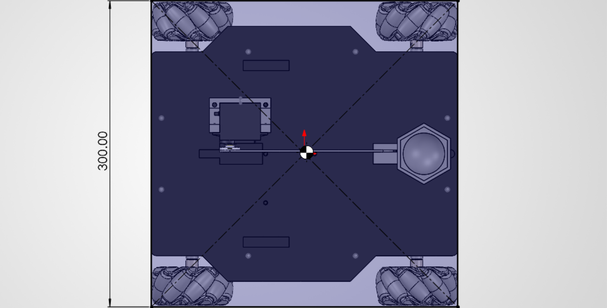
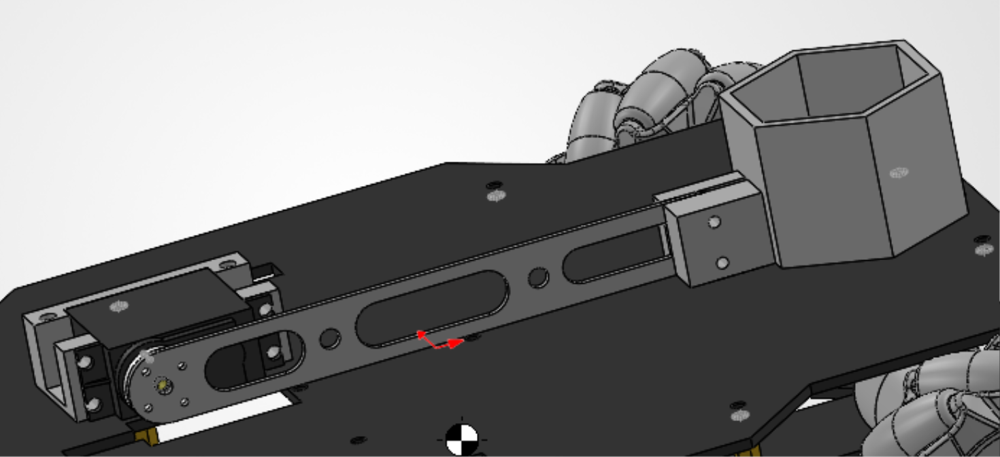

# 第七届“敢热爱，你就来”机甲大师校内赛 机器人制作规范

> 编写：赛事组委会 | 版本：V1.0 | 2026 年 10 月

## 目录

- 一、能源
- 二、无线通讯设备
- 三、主控板
- 四、驱动元件
- 五、外观设计
- 六、光学手段
- 七、设计尺寸
- 八、弹丸携带与作业机构
- 九、样车
- 附件一：推荐电子元器件型号

## 一、能源

1. 禁止使用燃油驱动的发动机、爆炸物、危险化学材料等。
2. 禁止使用液压或其他有可能产生污染的动力方式。
3. 机器人需使用组委会指定的电池或其他正规厂家生产的锂电池，电压不超过 **12V**，容量不超过 **4000mAh**。

## 二、无线通讯设备

1. 本次比赛推荐的遥控器产品为 **PS2 无线手柄**，也可选择其他无线控制手段。
2. 每台机器人仅允许搭载一个无线通信模块的接收端，且接收端只允许一个发送端与之对应。
3. 机器人不能搭载除遥控器以外的无线电通讯设备。

## 三、主控板

机器人使用的主控板需为 **STM32**、**51** 等单片机。

## 四、驱动元件

1. 电机供电电压不超过 **12V**。
2. 舵机扭矩不超过 **50kg·cm**。

## 五、外观设计

为防止机器人外壳影响场上竞技及观赛体验，设计与制作机器人外观时需遵循以下规范：

1. 机器人线路整齐、不裸露，无法避免的外露线材需用绕线管等理线工具进行保护。
2. 机器人外观中不得出现明显影响美观的材料。
3. 避免尖锐结构造成场地破坏和人员伤害。

## 六、光学手段

1. 机器人使用任何光学手段都不应对任何人员造成身体伤害。

## 七、设计尺寸

最大初始尺寸（**mm**，长 × 宽）：**300 × 300**（在地面的正投影不得超出 **300×300** 方形区域）。

高度不限，伸展、变形后的尺寸不限。

尺寸说明：本项沿用第六届的 **300×300mm** 上限。注意：场地隧道高 **220mm**，更高收益的平台弹丸位于 **450mm** 高度，若机器人需要穿越隧道，纯粹压缩尺寸的机器人将难以获得更多积分。需要机器人设计留有余量或者设计收缩变形结构。

【图：初始尺寸正投影示意图】

## 八、弹丸携带与作业机构

针对本届“大弹丸投送”任务，对机器人携带与作业机构作如下要求（详细规范后续发布）：

1. 机器人需具备稳定携带 **42mm** 大弹丸（球体，直径 **42mm**，带“R”标识）的能力，携带过程中弹丸不得滚落。
2. 机器人可通过发射击打或抬升移动等机构，使高层（离地 **450mm**）的大弹丸落地，再由机器人推入底层格子。
3. 携带与作业机构不得使用危险化学品、爆炸物或破坏性手段（如故意砸击场地、伤害人员）。
4. 机构动作不得违反《规则手册》第五章《违规与判罚》的相关规定。

【图：携带 / 发射机构示例图】

## 九、样车

SolidWorks 图纸见附件（由组委会补充）。

## 附件一：推荐电子元器件型号

| 名称 | 型号 | 价格（元/个） | 备注 |
| --- | --- | --- | --- |
| 电池 | 12V 锂电池组 | 20 | 容量 ≤4000mAh |
| 电机 | JGB37-520 编码器霍尔 12V-178 转/min 直流减速电机 | 15 | — |
| 电机 | TT 马达减速电机 | 5 左右 | — |
| 轮子 | 麦克纳姆轮（80mm 轮径，6mm 联轴器）/ 普通车轮（65mm 轮径） | 15 左右 | — |
| 遥控器 | PS2 无线手柄 | 35 | — |
| 主控板 | STM32F103C8T6 最小系统板 | 22 | — |
| 降压模块 | LM2596S DC-DC 可调降压电源模块 | 10 | — |
| 电机驱动 | TB6612 电机驱动模块 | 7 | — |
| 舵机 | MG995 金属数字舵机 | 20 | — |
| 线材 | 若干 | 20 | — |

> 以上清单与价格参考校内赛往届制作规范，具体采购渠道与最终型号由组委会在《物资供给手册》中统一发布。

> 注：本规范最终解释权归赛事组委会所有。