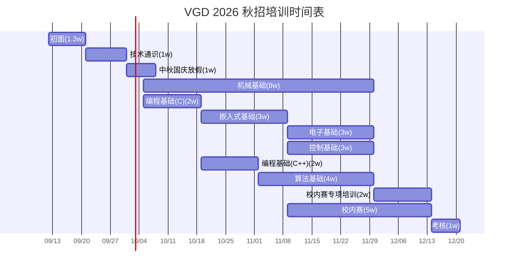

# 培训

这里是 VGD 2026 培训体系的导航页，主要包括 **资源链接** 和 **培训文档**。本文用于快速了解秋招培训的定位、课程方向、组织形式和参与方式。具体见培训策划书。

## 课程链接目录

- [培训策划书](/training/plan)

具体课程系列：

- [基础通识](/training/common)
- [机械](/training/mechanical)
- [编程](/training/programming)
- [嵌入式](/training/embedded)
- [控制](/training/control)
- [算法](/training/algorithm)

## 培训定位

- 时间：从 9 月下旬到 12 月上旬，时长约 9 周。
- 内容：入门零基础教程，包括线上（文档 & 视频）和线下课程（有录播）。
- 培训目标：
    1. 在培训中筛选肯学知识、肯下功夫、有一定能力和潜力、能够接受团队协作的人。
    2. 进行基础知识教学。
- 筛选方式：
    1. 课程中，不适应团队和学习压力，自动离开。
    2. 初面和考核筛选。
    3. 课程中的表现、积极性和学习潜力评价。
- 节奏：一周 1 节线下课，可能会有一节线上课；除此之外还有一些文档自行学习

## 课程形式

课程会按照技术点分类，分为多个系列的课程。部分适合线上课的内容，例如安装软件、基础操作、科普等，会作为线上课，便于回放和学习；这类内容线下讲必要性不高，也容易枯燥。

每节课程采用 **问题导向** 形式：每节课设定一个实践目标，需要通过学习某个硬相关的技术重点实现。教学完成目标的同时，掌握技术原理和实际经验。这种方式从实际出发，适合队伍需求，避免上课没意思、没有目的、进度慢的情况。

## 技术方向概览

- 团队文化通识：RM 比赛、VGD 队伍、机器人整体系统概论。
- 技术通识：赛博扫盲、电子通识、机械通识、计算机基础、科学上网、如何正确使用 AI、提问的艺术。
- 编程基础：编程入门、C 语言、C++（在 C 语言基础上）。
- 嵌入式基础：单片机与嵌入式、CubeMX/Keil、GPIO、TIM/PWM、HAL 库、串口、中断、PCB 绘制。
- 控制基础：以 PID 为例理解控制。
- 电子基础：电子件、PCB、电源与电路基础。
- 算法基础：Linux 和 ROS2 基础使用、OpenCV、机器视觉。
- 机械基础：机械结构及相关机械设计基础。

## 培训组概览

- 机械组：团队文化通识、技术通识、机械基础。
- 硬件组：团队文化通识、技术通识、编程基础（C）、嵌入式基础、电子基础。
- 电控组：团队文化通识、技术通识、编程基础（C）、嵌入式基础、控制基础。
- 算法组：团队文化通识、技术通识、编程基础（C/C++）、算法基础。

## 时间与考核概览

培训整体依次推进：初面、技术通识、中秋国庆放假、机械基础、编程基础、嵌入式基础、电子基础、控制基础、算法基础、校内赛专项培训、校内赛、考核。

