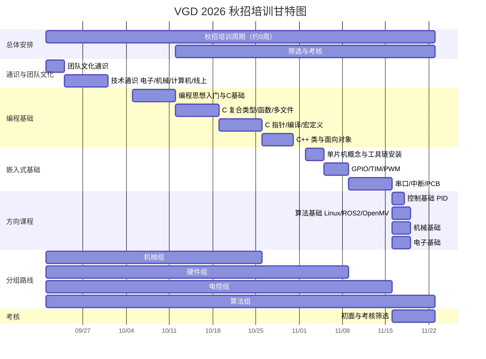

# 培训内容

<!--这里注释：
文档中使用的了很多缩进，统一用4个空格
-->

这里是 VGD**2026** 培训体系的导航页，主要包括 **资源链接** 和 **培训文档**。

## 课程链接目录

- [秋招培训总体计划](/training/plan)

具体课程系列：

- [基础通识](/training/common)
- [机械](/training/mechanical)
- [编程](/training/programming)
- [嵌入式](/training/)
- [控制](/training/control)
- [算法](/training/algorithm)

## 秋招培训总体介绍

- 时间：从9月下旬到11月底，时长约9周
- 内容：入门零基础教程，包括线上（文档 & 视频）和线下课程（有录播）
- 培训目标：
    1. 在培训中筛选肯学知识、肯下功夫、有一定能力和潜力、能够接受团队协作的人
    2. 进行基础知识教学
- 筛选方式：
    1. 课程中，不适应团队和学习压力，自动离开
    2. 初面和考核筛选
    3. 课程中的表现，积极性和学习潜力评价

# 课程形式

课程会按照技术点分类，分为多个系列的课程。课程中有的适合部分会作为线上课（例如安装软件，基础操作，科普等，作为线上课会便于回放和学习，没有线下讲的必要性，同时线下讲可能吸引力也不高有些枯燥）。

每节课程采用问题导向形式：每节课设定一个实践目标，需要通过学习某个硬相关的技术重点实现。同时教学完成目标同时掌握技术原理和实际经验。这种方式从实际出发，适合队伍需求，避免了上课没意思，没有目的，进度慢的情况。

## 技术方向课程分类

> 括号中为课时数，0为线上课

1. 团队文化通识（1）
    - 关于 RM 比赛（规则，兵种介绍，日程，官方账号&网站）
    - 关于 VGD 队伍（制度，历史，账号链接）
    - 机器人整体系统概论（组成，技术组工作）
2. 技术通识
    - 赛博扫盲（0，仅资料）
    - 电子通识（电子常识、焊接）（0.5）
    - 机械通识（0.5）
    - 计算机基础（git，命令行，了解操作系统）（0）
    - 科学上网（-0）
    - 如何正确使用AI（0）
    - 提问的艺术（0）
3. 编程基础
    - 入门：编程思想是什么，怎么写代码，编程的历史（0）
    - C：
        1. 基本数据类型、运算（0.5）
        2. 复合数据类型（struct，array），复合运算（函数）（0.5）
        3. 多文件编程，定义声明和引用（1）
        4. 指针（-1）
        5. 编译、宏定义和预处理（0）
    - C++（在 C 语言基础上）
        1. 类和面向对象（1）
        > TODO
4. 嵌入式基础
    - 什么是单片机，嵌入式是什么（0）
    - CubeMX、Keil 的安装，怎么运行/添加文件/烧录（0）
    - keil，标准库，GPIO，点灯（1）
    - TIM，PWM，呼吸灯（1）
    - CubeMX，HAL库，串口，中断（1）
    - 自己绘制一个 PCB 板（最小系统板？）（1）
5. 控制基础
    - 什么是控制：以PID为例（0）
    - 
6. 电子基础
7. 算法基础
    - 了解 Linux 和 ROS2，基础使用
    - openmv，机器视觉
8. 机械基础
    - 机械结构
    > TODO
    > 我不会机械捏 *by Serialist*
    
## 上课形式

系统性的教各种知识一是慢，二是他们能够消化的少，三是他们学到后可能会认为没有意义

# 具体培训组课程安排

## 机械组

1. 团队文化通识（0）
2. 技术通识（1）
    - 电子通识
    - 机械通识
3. 机械基础（...）

## 硬件组

1. 团队文化通识（0）
2. 技术通识（1）
    - 电子通识
    - 机械通识
    - 计算机基础
3. 编程基础（2）
   - C
4. 嵌入式基础（4）
5. 电子基础（...）

## 电控组

1. 团队文化通识（0）
2. 技术通识（1）
    - 电子通识
    - 机械通识
    - 计算机基础
3. 编程基础（2）
   - C
4. 嵌入式基础（4）
5. 控制基础（...）

## 算法组

1. 团队文化通识（0）
2. 技术通识（1）
    - 电子通识（电子常识、焊接）
    - 机械通识
    - 计算机基础
3. 编程基础（4）
   - C
   - C++
4. 算法基础（...）
