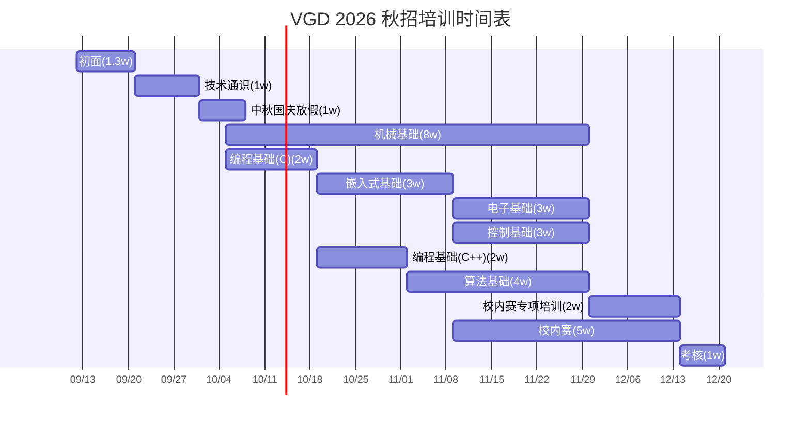

# 培训

我们的培训分为基础培训和梯队培训。

秋招面向大一大二零基础同学。

**基础培训**由技术组开展，成员是各个技术组的老队员，时间约一个月，课程向所有人开放。

**校内赛**用时一个月，面向所有人。结束后进行**梯队队员考核**，成为梯队队员。

**梯队培训**面向内部，前期统一布置任务，学习基础知识；后期划分方向，老带新进入兵种组学习。

在一年结束后，会面向有基础同学进行夏招，梯队队员和夏招进行**正式队员考核**，成为正式队员。

## 课程链接

- [机械](/training/mech)
- [电控](/training/control)
- [硬件](/training/elec)
- [算法](/training/algo)
- [软件](/training/software)
- [宣运](/training)

## 技术概览

- 通识：RM 比赛、VGD 队伍、了解机器人、正确使用 AI、提问的艺术
- 机械：机械结构及相关机械设计基础
- 电控：C、嵌入式STM32、控制理论
- 硬件：C、嵌入式STM32、PCB、电源与电路基础
- 算法：C++、Linux 和 ROS2、视觉、SLAM感知和自主规划、决策、控制

## 时间进度

```mermaid
gantt
    title VGD 2026 秋招培训时间表
    dateFormat YYYY-MM-DD
    axisFormat %m/%d

    初面(1.3w): 2026-09-12, 9d
    技术通识(1w): 2026-09-21, 10d
    中秋国庆放假(1w): 2026-10-01, 7d
    机械基础(8w): 2026-10-05, 56d
    编程基础(C)(2w): 2026-10-05, 14d
    嵌入式基础(3w): 2026-10-19, 21d
    电子基础(3w): 2026-11-09, 21d
    控制基础(3w): 2026-11-09, 21d
    编程基础(C++)(2w): 2026-10-19, 14d
    算法基础(4w): 2026-11-02, 28d
    校内赛专项培训(2w): 2026-11-30, 14d
    校内赛(5w): 2026-11-09, 35d
    考核(1w): 2026-12-14, 7d
```

## Reference

我们正在尝试做更好的培训体系。有很多队伍都开源了自己的培训资料，也可以多看看。

[pnx战队文档](https://hkustgz-robomaster-pnx.github.io/training/ )
