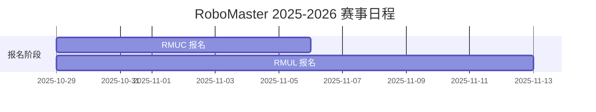
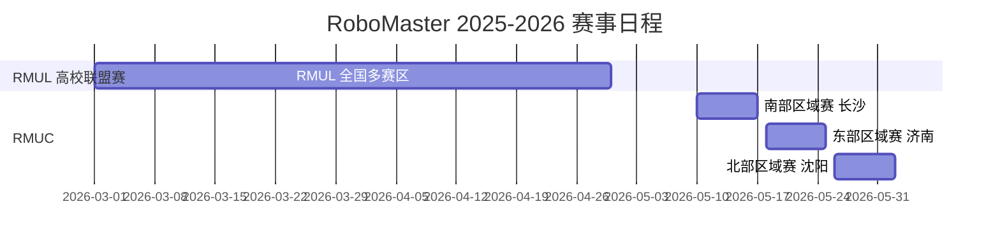
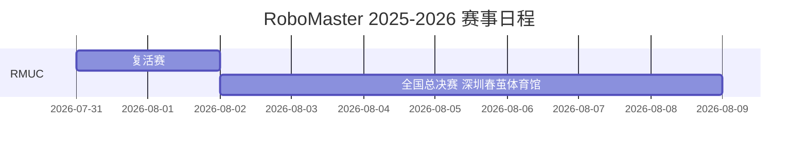

# RoboMaster 入坑指南

RoboMaster（简称RM）是由 DJI 大疆发起的全球机器人比赛，包含多项赛事：

1. **高校联盟赛（RMUL）**
    - 3v3 对抗赛：步兵、重装、哨兵三个兵种，3v3 互相对抗
    - 步兵对抗赛：步兵机器人 1v1 单挑
    - ~~工程挑战赛~~：2027赛季已取消
- **超级对抗赛（RMUC）**：
    全兵种 7v7 对抗，类似moba游戏，以摧毁对方基地为目标。
    比赛分为两阶段：
    - 区域赛（三个赛区，每赛区32支队伍）
    - 复活赛 + 全国赛

VGD战队主攻方向为高校联盟赛与超级对抗赛。

> **26赛季特别说明**：联盟赛规则在编写期间有新规出台，具体赛制可能发生变化，请以官方最新发布为准。RMUC 2026将不设置港澳台及海外赛区和邀请赛。

## 兵种区别

- **步兵**
    应对复杂地形，机动性强，负责战术游走
- **哨兵**（烧饼）
    唯一**全自动**无操作手，自动导航，自主决策，拥有纯粹的数值。善于完成防守、巡逻、火力输出，甚至主动作战，占领对方堡垒
- **工程**
    装配能量单元，提供资金和buff
- **空中**（无人机）
    高空全场侦察，提供火力压制
- **飞镖**
    发射镖体对前哨站和基地进行高额打击。
- **雷达**
    全场感知与数据融合。

## 建筑物与地形

比赛场地内设有多种建筑物，部分具有增益效果，是战术博弈的关键节点：

- **能量机关（俗称“大符”）**：位于场地中央旋转的大型机关，也称作“大符”或“能量机关”。参赛队伍通过击打其可获得增益效果。26赛季能量机关整局持续转动，需激活灯币获取增益。
- **前哨站**：瘦高型建筑，是基地的前沿防线。26赛季前哨站重建为三块高度不一样的装甲板。前哨站存活时基地处于无敌状态。
- **基地**：比赛的核心目标，摧毁对方基地即为胜利。基地初始仅有顶部装甲板外露，满足条件后护甲才会展开。
- **地形要素**：
  - **隧道（俗称“狗洞”）**：26赛季增设的狭窄隧道地形，鼓励研究小型化、具有变形能力的机器人。
  - **堡垒增益点**：为落后一方提供新的战术思路。

## 增益与限制

为鼓励技术创新并将技术能力转化为战力，官方设置了多项增益与限制机制。机器人在比赛初期处于受限状态，通过技术操作可解锁增益。

**限制机制**

- **热量限制**：具有发射机构的机器人，对单次可发射的弹丸数量设有限制。每发射一发17mm弹丸，枪口热量增加10点；42mm弹丸增加100点。
- **热量冷却**：决定脱战后热量恢复速度，冷却越快则再战能力越强。
- **功率限制**：限制电机输出功率。更好的功率分配能让电机发挥更强性能。

**增益机制**

- **防御增益**：增加机器人防御力，降低弹丸伤害。
- **致盲**：使对方图传画面黑屏，干扰操作手视野。
- **开花（基地护甲展开）**：基地初始仅顶部装甲板外露，满足条件后底部护甲展开，暴露可攻击区域。
- **基地无敌**：为保证比赛观赏性，在特定条件下基地处于无敌状态。

## 重要时间节点

以下是2026赛季RM赛事的关键时间安排，供VGD战队规划备赛进度参考：

