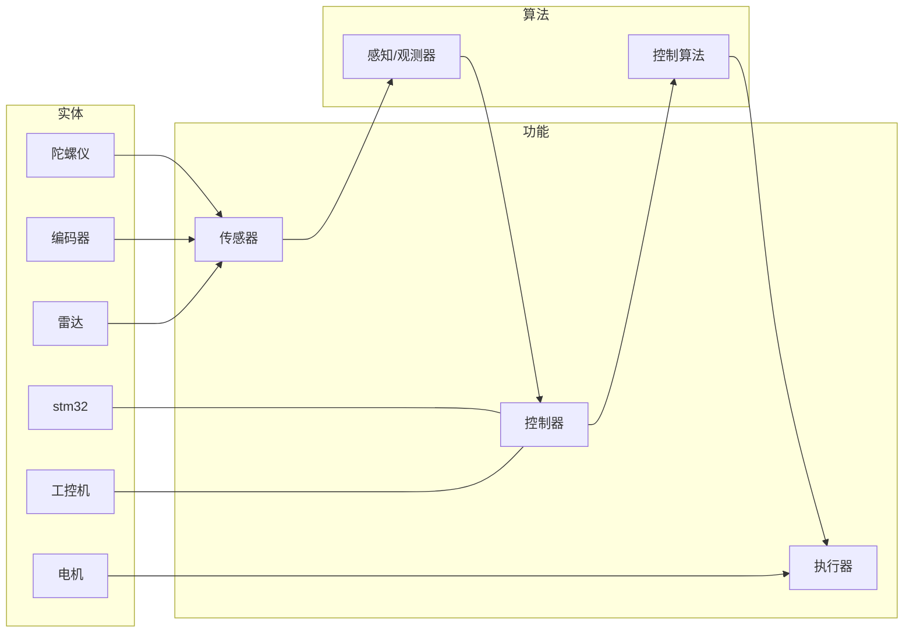

# 机器人的构成

做一个机器人，就是在感知-控制-执行。其中：

- 机械：设计机器人机械结构
- 硬件：设计机器人上的电路模块（超级电容、无线充电、电池缓启动、主控模块）
- 电控：主要在单片机做感知、控制（实时控制）
- 算法：在工控机做感知、控制（视觉识别，slam和自主导航，机械臂轨迹规划）

## Reference

感谢 pnx 战队的资料：[PNX 培训中心 | PNX Robotics](https://hkustgz-robomaster-pnx.github.io/training/?doc=Zuw7dRErhoBzuWxvo3tcNLNknqg#section-doxcnVkldk2DBfhH42pzpfikG8d)
