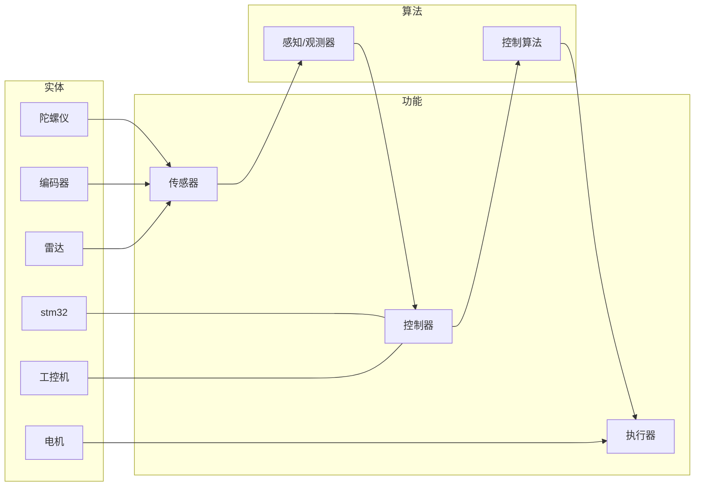

# 机器人的构成

做一个机器人，就是在感知-控制-执行。其中：

- 机械：机器人平台的结构
- 硬件：机器人平台的电路模块
- 电控：感知、控制（主要在嵌入式运算）
- 算法：感知、控制（在工控机运算）（aka. 小电脑、上位机）

## Reference

感谢 pnx 战队的资料：[PNX 培训中心 | PNX Robotics](https://hkustgz-robomaster-pnx.github.io/training/?doc=Zuw7dRErhoBzuWxvo3tcNLNknqg#section-doxcnVkldk2DBfhH42pzpfikG8d)
