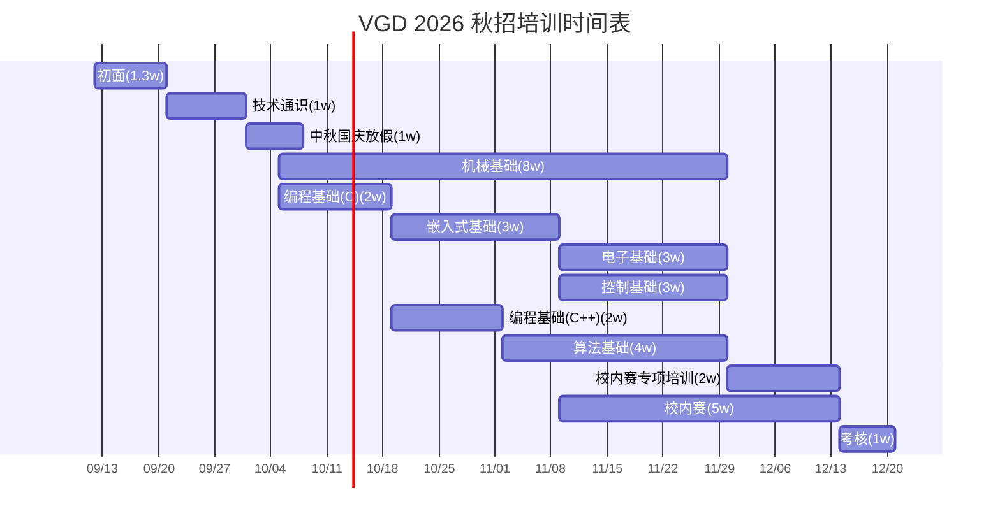

<!--

# 培训策划书

仅供参考，具体情况会变动

## 总体安排

- 时间：从 9 月下旬到 10 月，时长约 5 周
- 内容：入门零基础教程，包括线上（文档 & 视频）和线下课程（有录播）
- 培训目标
    1. 在培训中筛选肯学知识、肯下功夫、有一定能力和潜力、能够接受团队协作的人
    2. 进行基础知识教学
- 筛选方式
    1. 课程中，不适应团队和学习压力，自动离开
    2. 初面和考核筛选
    3. 课程中的表现、积极性和学习潜力评价
- 节奏：一周 1 节线下课，可能会有一节线上课

## 课程形式

课程会按照技术点分类，分为多个系列的课程。课程中有的适合部分会作为线上课，例如安装软件、基础操作、科普等。作为线上课便于回放和学习，没有线下讲的必要性，同时线下讲可能吸引力也不高、有些枯燥

每节课程采用 **问题导向** 形式：每节课设定一个实践目标，需要通过学习某个硬相关的技术重点实现。同时，教学完成目标的同时掌握技术原理和实际经验。这种方式从实际出发，适合队伍需求，避免了上课没意思、没有目的、进度慢的情况

系统性地教各种知识一是慢，二是他们能够消化的少，三是他们学到后可能会认为没有意义。因此，培训以问题导向、实践目标驱动为主，每节课尽量围绕一个可完成、可验收的目标展开。

## 技术方向课程分类

> 括号中为课时数，0 为线上课。个别负号项为原稿标记，具体排课时再确认

### 通识

- RM 比赛介绍：规则、兵种、备赛日程
- VGD 队伍介绍：制度、历史
- 相关链接
- 机器人组成、技术组工作
- 赛博扫盲、计算机基础、命令行、操作系统、Linux
- Git 代码管理
- 科学上网
- 如何使用 AI
- 提问的艺术

### 编程

- C 语言
    1. 基本数据类型、运算（0.5）：程序思想、基本数据类型、基本运算
    2. 复合数据类型（struct，array）、复合运算（函数）（0.5）
    3. 多文件编程，定义声明和引用（1）
    4. 指针：指针和数组，作为进阶重点
    5. 编译、宏定义和预处理（0）：编译、宏和头文件
- C++
    1. 类和面向对象（1）：类和命名空间
    2. 拓展：模板和继承、CMake 编译和 C++11 新特性（xinge）

### 嵌入式

- 什么是单片机，嵌入式是什么；Keil 的安装，怎么运行 / 添加文件 / 烧录
- Keil、标准库、嵌入式是什么、GPIO、点灯
- TIM、PWM、呼吸灯、调试
- CubeMX 安装、创建工程
- CubeMX、HAL 库、串口、中断
- 自己绘制一个 PCB 板（最小系统板？）
- 安装 CubeMX 和 Keil
- 转 HAL 库，串口和中断
- 进阶内容
    - CAN 通信
    - 内存分区和 DMA
    - FDCAN 通信和 RS485 通信

### 控制基础

- 什么是控制：以 PID 为例（0）
- 进阶内容：PID 控制器
- 支撑数学（可作为控制 / 算法支撑或选修）
    - 线性代数、姿态变换

### 电子基础

- 入门内容
    - 电子件与 PCB 初识
    - 绘制最小拓展板（嘉立创）
    - buck 电路
    - 半桥电路
    - LDO 电路
- 进阶内容
    - 四开关 Buck-Boost 电路
- 面向：电控 + 硬件

### 算法基础

- 了解 Linux 和 ROS2，基础使用
- OpenCV，机器视觉
- 可衔接内容
    - Linux 和计算机基础：计算机硬件介绍、操作系统、Linux 介绍和基本使用、命令行、安装 Ubuntu、Git 代码管理
    - 如何使用 AI 编程和学习
    - C++ 小项目可作为第一轮算法入队考核
- 课时参考：算法基础（4 周）

### 机械基础

课时：5 周

- 草图绘制
    参考负责人：汪奥林 / 李培佳
    1. SW 画图基础
    2. 特征学习
    3. 零件命名与赋材料
    4. 装配体配合 + 设计工具（常用）
- 理论力学 + 材料力学入门
    参考负责人：廖潇俊 / 张雨轩
    1. 了解力与力矩、二力平衡、三力平衡等基础知识
    2. 了解虚功原理与瞬心点法确定运动，以及点的合成运动
    3. 了解材料拉压、扭转、剪切变形的计算
    4. 会计算悬臂梁、简支梁的最大应变
- 材料选型与零件选型与加工工艺入门
   参考负责人：曹大为 / 张锦龙 / 敬晨涛
- 传动与轴系设计，如何定位零件
    参考负责人：刘义 / 廖潇俊

## 具体培训组课程安排

### 机械

1. 通识
2. 机械基础（见“技术方向课程分类·机械基础”）

### 硬件

1. 通识
2. C 基础
3. 嵌入式基础（4）
4. 电子基础（见“技术方向课程分类·电子基础”）

### 电控

1. 通识
2. C
3. 嵌入式
4. 控制

### 算法

1. 通识
2. C++
3. 算法基础

## 时间计划图

```mermaid
gantt
    title VGD 2026 秋招培训时间表
    dateFormat YYYY-MM-DD
    axisFormat %m/%d

    初面(1.3w): 2026-09-12, 9d
    技术通识(1w): 2026-09-21, 10d
    中秋国庆放假(1w): 2026-10-01, 7d
    机械基础(8w): 2026-10-05, 56d
    编程基础(C)(2w): 2026-10-05, 14d
    嵌入式基础(3w): 2026-10-19, 21d
    电子基础(3w): 2026-11-09, 21d
    控制基础(3w): 2026-11-09, 21d
    编程基础(C++)(2w): 2026-10-19, 14d
    算法基础(4w): 2026-11-02, 28d
    校内赛专项培训(2w): 2026-11-30, 14d
    校内赛(5w): 2026-11-09, 35d
    考核(1w): 2026-12-14, 7d
```

-->