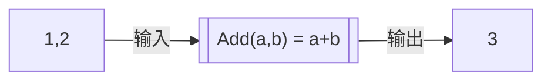

# C 语言第一讲

0. 什么是编程，什么是 C 语言  
1. 变量和字面量  
2. 基本数据类型和基本运算  
3. 程序流程：顺序、分支、循环  
4. 复合数据类型和复合运算（函数）  
5. 作用域、生命周期和存储期  
6. 多文件、extern、include、定义 vs 声明 vs 使用  

## 什么是编程 and C 语言

- 数据：被编码的信息（example: 用数字表示文字

    

- 运算：变化数据（把一个数据变为另一个数据）

    ```c
    int a = 1 + 2;
    int b = a * 100;
    ```

**程序**

-   通过一些规定好的运算，输入数据，得到结果数据，就是程序

    一个数学函数就是一段程序：$f(x) = x^2 - 3x + 4$

    ```c
    float f(float x){
        return x*x + 3*x + 4;
    }
    ```

    有个司机是个人机，他在十字路口的行为也是程序：

    ```c
    行为 一个司机(要去的方向, 红绿灯){
        if(要去的方向 的 红绿灯 == 红)
            return 停车;
        else 
            return 开车到 要去的方向;
    }
    ```

**编程**

-   在上面，我们用（伪）代码表示了程序，这就是编程

-   按照一定语法，表示一段程序

    （语法糖：不是必要语法，是为了方便而设计）

**编译**

-   把这种语言，变成计算机二进制程序，就是编译

**C 语言**

- 一种语法
- 接近底层效率高：能直接操作内存，常用于操作系统、嵌入式、驱动
- 语法简洁：但你需要负责大量底层细节
- 老资历：大量现代语言如 C++、Java、C#、Go、Rust 都受到 C 的影响

## 变量和字面量

运行中的程序，会涉及这几种空间：

1. 硬盘 
   保存程序文件，断电后还在，速度慢。

2. 内存：静态区
   运行时，会先把程序和常量 copy 到内存，因为速度比硬盘快很多（ 约一万倍 ）

3. 内存：栈堆
   
   临时或动态分配的变量、一些临时程序信息

4. **寄存器** 
   CPU 内，运算单元手边，速度极快，随放随用

### 字面值

字面量：直接写在代码里的值，不占堆栈，直接放在指令里或静态区

```c
1
3.14
'A'
"hello"
```

### 变量

有名字的存储空间，占用堆栈，如：

```c
int a;
```


---

## 基本数据类型和基本运算

### 基础数据类型

- 以整数形式储存：
  - `char`、`short`、`int`、`long`、`long long`，依次占用 1、2、4、8、16 byte大小空间
  
      （也有 `long int` 和 `short int` 的写法）
  
  - 修饰词：`signed`、`unsigned`
  
- 以小数形式（浮点数）储存：
  - `float`、`double`、`long double`
  
- 指针：
  - 另一个变量或数据所在的内存空间位置（内存地址）
  
- `void`：
  
  - 无类型、无返回值

类型决定了数据怎么储存（对齐和大小），程序如何看待这个值（运算规则）

### 基本运算

赋值：`a = 1;`

数值运算：`+ - * /` 和 `%`

- 整数除法，是整除，如 `5 / 2 == 2`
- `%` 是取余数，只能用于整数
- 除 0 是未定义行为，数据溢出也是

关系运算：`> < >= <= == !=`

结果是真 / 假，C 中通常用 `1 / 0` 表示。

逻辑运算：与或非

```c
a < 10 && a > 0;
a > 10 || a < 0;
!(a > 10)
```

位运算：

```c
<< >> & | ^ ~
```

直接操作二进制位（有符号数的移位、溢出属于未定义行为）

强制类型转换：`(类型)表达式`

```c
(int)1.2 == 1
```

其他语法糖：

```c
+= -= *= /= %= // a += b 相当于 a = a+b
++ --          // a++    相当于 a = a+1
?:             // 小型 if-else
```

运算有优先级，不确定多用括号（括号优先级最高）

## 执行流：顺序、分支、循环

程序按照一定流程执行：

- 顺序：从上到下，依次
- 分支：根据条件，选择其中一个执行
- 循环：满足条件时，重复执行

### 顺序结构

顺序结构是最简单的流程：代码从上往下执行。

```c
int a,b,c;
a = 1;
b = a + 1;
c = a * b;
```

多条语句可以用一对大括号 `{ ... }` 组成复合语句，也叫块：

```c
{
  int a,b;
  a = 1;
  b = a + 1;
}
```

### 分支

if-else 是最基础的分支结构

```c
int score = 85;

// ---------------- 只有两个
if (score > 60)
    printf("及格");
else
    printf("不及格");

// ---------------- 如果要执行多个语句
if (score > 60){
    printf("你真棒！");
    printf("及格");
}
else
    printf("不及格");

// ---------------- 有多个用 if else
if (score > 90)
    printf("优秀");
else if (score > 60)
    printf("及格");
else
    printf("不及格");
```

C 语言 `0` 表示假，非 `0` 表示真，所以下面写法也合法：

```c
int score = 60;
if (score) 
    printf("不是 0");
else
    printf("是 0");
```

条件运算符 ?:

```c
int a = 10, b = 20;
int max = (a > b) ? a : b; // 如果 `a > b` 为真，取 `a`，否则取 `b`
```

当你要判断整数（枚举）是不是某个固定值时，可用 `switch`：

```c
char op = '+';
int a = 3;
int b = 5;
int result = 0;

switch (op) {
    case '+':
        result = a + b;
        break;
    case '-':
        result = a - b;
        break;
    case '*':
        result = a * b;
        break;
    default:
        printf("未知运算符\n");
        break;
}
```

- `case` 后面必须是常量
- `case` 后面要写 `break`，否则会接着执行到下一个 `case`
- `default` 处理没有匹配到的情况

---

### 循环结构

重复执行一段代码。常见循环有 `while`、`do-while`、`for`。

#### while

```c
int i = 1;
int sum = 0;

while (i <= 10) {
    sum += i;
    i++;
}
```

执行逻辑：

1. 判断 `i <= 10`
2. 如果为真，执行循环体
3. 回到第 1 步继续判断
4. 如果为假，结束循环

#### do-while

`do-while` 至少执行一次循环体：

```c
int i = 1;
int sum = 0;

do {
    sum += i;
    i++;
} while (i <= 10); // 注意末尾有分号！！！
```

#### for

其实是加了语法糖的while，适合“次数明确”的循环：

```c
int sum = 0;

for (int i = 1; i <= 10; i++) {
    sum += i;
}
```

它把循环三要素写在一起：

```c
for (初始化; 循环条件; 每轮更新) {
    循环体;
}
```

等价于：

```c
初始化;
while (循环条件) {
    循环体;
    每轮更新;
}
```

#### break 和 continue

- `break`：立即跳出当前循环或 `switch`。
- `continue`：跳过本次循环剩下的部分，进入下一次循环。

```c
for (int i = 1; i <= 10; i++) {
    if (i == 5) {
        break;  // 到 5 就结束整个循环
    }
    printf("%d ", i);
}
```

```c
for (int i = 1; i <= 10; i++) {
    if (i % 2 == 0) {
        continue;  // 偶数跳过
    }
    printf("%d ", i);
}
```

`break` 只跳出最内层循环或 `switch`，不会一次跳出所有嵌套循环。

#### goto

C 语言还有 `goto`，但不推荐滥用

```c
goto end;

printf("不会执行\n");

end:
printf("结束\n");
```

## 复合数据类型、复合运算（函数）

### 复合数据类型

#### 数组 array

一组同类型数据连续存放，用下标访问，下标从 0 开始。

```c
int a[5]; // a[0] ~ a[4]
```

- 数组越界不会自动检查，可能会炸
- 数组名在多数表达式中会退化为首元素指针。
- 数组长度必须是字面值

#### 结构体 struct

把不同类型的数据组合成一个整体。

```c
struct Point {
    int x;
    int y;
};
```

使用时：

```c
struct Point p;
p.x = 1;
p.y = 2;
```

#### 枚举 enum

给整数常量起名字。

```c
enum Color {
    RED,
    GREEN,
    BLUE
};
```

默认从 0 开始递增：`RED == 0`，`GREEN == 1`，`BLUE == 2`。  也可以手动指定：

```c
enum Color {
    RED = 1,
    GREEN = 5,
    BLUE = 4,
};
```

#### 联合体 union

多个成员共用同一块内存，同一时间通常只用一个成员（用的很少）

```c
union U {
    int i;
    float f;
};
```

---

### 复合运算：函数！！！

函数的意义：

- 程序复用
- 简洁，提高可读性
- 逻辑清晰、便于维护和分工

函数就是一个加工厂：输入数据，处理/运算，输出数据。



C 语言写就是：

```c
int Add(int a, int b) {
    return a + b;
}
```

相当于：$f(a, b) = a + b$

如果一段运算很长，反复写会让程序变得超级大：

```c
// 某一段程序
// 然后用了一段运算过程：
... 此处省略100行;
// 后来又用了一遍：
... 此处省略100行;
// 后来又用了一遍：
... 此处省略100行;
```

这时可以把这段运算包装成函数，每次使用时，把需要的变量送给函数，然后函数传出结果：

```c
void A_Long_Function() {
    // ... 此处省略100行
}

int main(void) {
    A_Long_Function();
    // 另一处
    A_Long_Function();
    // 然后再使用一次
    A_Long_Function();
}
```

### 为什么入口函数叫 main？

当你把整个程序看成一场巨大的复合运算，它其实就是一个函数。

老资历们制定了 C 标准，约定程序入口是 `main` 函数，所以编译器会默认找 `main` 函数去执行。

```c
int main(void) {
    return 0;
}
```

可以指定别的入口，但非标准、不推荐

## 多文件、定义/声明/使用

如果想把程序分为多个模块，往往会创建多个 `.c` 文件，用来储存不同的模块。

常见做法：

- `.c` 文件：放函数定义、变量定义。
- `.h` 文件：放函数声明、类型声明、宏、外部变量声明。

### 定义、声明、使用


- **声明**：告诉程序：有这个名字，类型是什么，函数怎么用（传入什么，返回什么）
  
  ```c
  int Add(int a, int b);
  extern int g_count;
  ```
  
- **定义**：真正给变量分配存储空间、给出函数体
  
  ```c
  int g_count = 0;
  
  int Add(int a, int b) {
      return a + b;
  }
  ```
  
- **调用**：使用写好的函数
  
  ```c
  int main(){
      int x = Add(1, 2);
      g_count++;
  }
  ```

### extern

`extern` 用于声明外部链接的变量或函数。

```c
extern int g_count; // 表示 `g_count` 在别的文件中定义。
```

函数声明默认就是外部链接，所以下面两个等价

```c
int Add(int a, int b);
extern int Add(int a, int b);
```

### include

`#include` 是预处理指令，会把另一个文件的内容插入到当前位置。

```c
#include <stdio.h>
#include "math.h"
```

- `<...>`：常用于系统头文件
- `"..."`：通用于**自己写**的头文件

头文件通常要防止重复包含：

```c
int Add(int a, int b);
extern int g_count;
```

### 多文件示例

`math.h`：

```c
int Add(int a, int b);
extern int g_count;
```

`math.c`：

```c
#include "math.h"

int g_count = 0;

int Add(int a, int b) {
    g_count++;
    return a + b;
}
```

`main.c`：

```c
#include <stdio.h>
#include "math.h"

int main(void) {
    int x = Add(1, 2);
    printf("x = %d, g_count = %d\n", x, g_count);
    return 0;
}
```

编译：

```bash
gcc main.c math.c -o app
```

运行：

```bash
app.exe
```

- 头文件只放声明，不放变量定义和函数定义。
- 不要 `#include "x.c"`
- 定义放 `.c`
- `static` 可以限制名字只在当前文件可见，或让局部变量具有静态存储期。