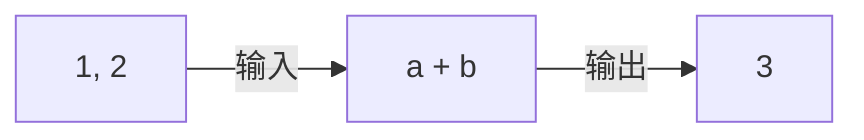

# C 语言第一讲

1. 基本数据类型和基本运算
2. 复合数据类型（struct，array）和复合运算（函数）

## 什么是编程，什么是C语言

编程的核心有两个：
- 数据
- 运算

通过一定规则的运算，把数据变为希望的样子，就是程序。

运算：把一段信息变为另一段信息。

数据：可以被编码保存的信息。

C语言：编程语言老祖，很多现代语言都受它影响。

语法：按照一定写法，编码一段程序。

语法糖：除了基本语法外，为了方便创建的语法。

## 变量和字面值

运行的程序，会涉及这几种空间：

1. 硬盘：保存程序文件，断电后还在，速度慢。
2. 内存中的代码段/只读数据段（如 `.text`、`.rodata`）：运行时操作系统会把程序代码和常量加载到内存，速度比硬盘快非常多。
3. 内存中的栈和堆：栈存函数调用信息、局部变量等；堆存动态分配的数据。
4. 寄存器：在 CPU 内部，速度极快，数量很少，运算时随用随放。

字面值：直接写在代码里的值，如 `1`、`3.14`、`'A'`。字面值通常不占栈空间，可能直接编码在指令里或放在只读数据段。

变量：有名字的存储位置，如 `int a;`。局部变量通常占栈空间；全局变量、静态变量和动态分配的数据则放在其他内存区域。

## 基本数据类型、基本运算

### 基础数据类型

包括：

- 以整数形式储存：
  `char`、`short`、`int`、`long`、`long long`
  修饰词：`signed`、`unsigned`
- 以小数形式储存：
  `float`、`double`、`long double`
- 指针（地址）：保存另一个变量或数据所在的内存地址。

类型决定：占多少字节、能表示什么值、能做哪些运算。C 标准没有固定 `int` 一定是几字节。

### 基本运算

赋值：`=`

数值运算：`+ - * / %`。注意整数除法会截断，`%` 取余。

关系运算：`> < >= <= == !=`，结果是真/假，C 中通常用 `1/0` 表示。

逻辑运算：`&& || !`。

位运算：`<< >> & | ^ ~`，直接操作二进制位。

强制类型转换：`(类型)表达式`。

其他复合运算的语法糖：`+=`、`-=`、`*=`、`/=`、`%=`、`++`、`--`、`?:` 等。

## 复合数据类型，函数

### 复合数据类型

数组 array：一组同类型数据连续存放，用下标访问，下标从 0 开始。

```c
int a[5]; // a[0] ~ a[4]
```

结构体 struct：把不同类型的数据组合成一个整体。

```c
struct Point {
    int x;
    int y;
};
```

枚举 enum：给一组整数常量起名字。

```c
enum Color { RED, GREEN, BLUE };
```

联合体 union：多个成员共用同一块内存，同一时间通常只用一个成员。

```c
union U {
    int i;
    float f;
};
```

### 复合运算（函数）

函数的意义：
- 程序复用
- 简洁，提高可读性
- 逻辑清晰
- 便于调试、维护和分工

函数就是一个加工厂：输入数据，处理运算后输出数据。

其实一段最简单的运算也可以看成一个函数：



我们可以叫它 Add 函数，用 C 语言写就是：

```c
int Add(int a, int b) {
    return a + b;
}
```

相当于 $f(a,b) = a + b$。

在编程时，这种小运算可以用一行表达式直接写。但是如果我们需要写一个包含很多运算的函数，这个函数在运算时还要用许多临时变量的话，我们肯定不能每次都写一遍，这会把程序变得超级大：

```
// 某一段程序
// 然后用了一段运算过程：
... 此处省略100行
// 后来又用了一遍：
... 此处省略100行
```

这时候，我们把这段运算包装成函数，每次使用时，把一些需要的变量送给函数，然后函数传出结果：

```c
int Add(int a, int b) {
    return a + b;
}

int main(void) {
    int x = Add(1, 2);    // 把 1, 2 送给 Add，得到 3
    int y = Add(10, 20);  // 把 10, 20 送给 Add，得到 30
    return 0;
}
```

说明：
- `a`、`b` 是形参，调用时接收传进来的值。
- `1`、`2` 是实参，是真正送给函数的数据。
- `return` 把结果交回调用处。
- `main` 是程序入口，返回 `0` 通常表示程序正常结束。
- 如果函数不需要返回值，返回类型写 `void`；如果不需要参数，参数可以写 `void`。
- 函数一般要先定义或声明，再使用。

这样，一段运算只写一次，后面需要时直接调用函数即可。